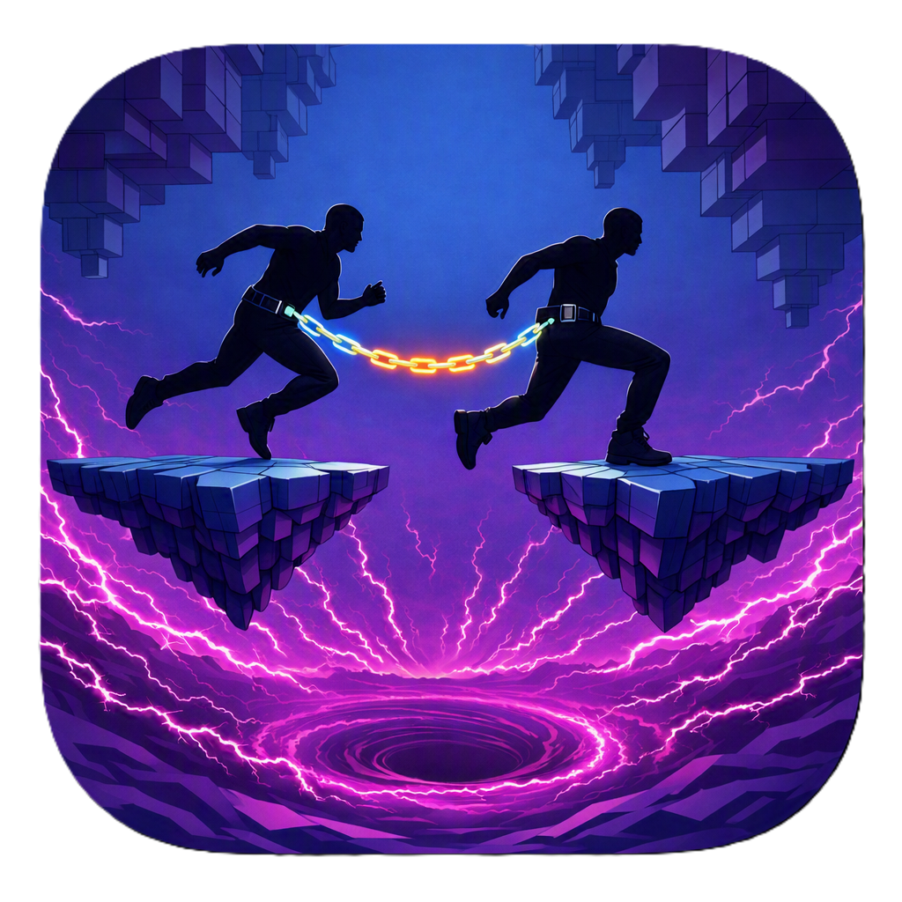

<p align="center">
  
</p>

<h1 align="center">⛓️ Chainmates — Endless Co-Op Climb</h1>

<p align="center">
  <strong>A Mobile-First Co-Op Tether Climbing Experience for Decentraland</strong><br/>
  Built for the <strong>Friendzone Mobile Buildathon 2026</strong> ($8,000 MANA Prize Pool).
</p>

<p align="center">
  <a href="https://docs.decentraland.org/creator/"></a>
  
  <a href="https://chainmates.onrender.com/health"></a>
  
  
</p>

---

## 📑 Table of Contents

- [🌟 Project Overview](#-project-overview)
- [🏆 What Makes Chainmates Unique](#-what-makes-chainmates-unique)
- [🎮 Core Game Mechanics](#-core-game-mechanics)
  - [1. Dynamic 4.0m Elastic Tether](#1-dynamic-40m-elastic-tether)
  - [2. Solo Practice Mode & AI Ball Droid](#2-solo-practice-mode--ai-ball-droid)
  - [3. The Rising Electric Void Abyss](#3-the-rising-electric-void-abyss)
  - [4. Infinite Procedural Platform Recycling](#4-infinite-procedural-platform-recycling)
  - [5. Cyber-Gems & Continuous Scoring Engine](#5-cyber-gems--continuous-scoring-engine)
  - [6. Rapid Rematch Loop](#6-rapid-rematch-loop)
- [📱 Mobile-First UX & Ergonomics](#-mobile-first-ux--ergonomics)
- [🕹️ Controls Reference](#️-controls-reference)
- [🏗️ System Architecture](#️-system-architecture)
  - [Codebase Structure](#codebase-structure)
  - [Multiplayer Network Architecture](#multiplayer-network-architecture)
  - [Authoritative Leaderboard Backend](#authoritative-leaderboard-backend)
- [🎨 Visuals & Audio Design](#-visuals--audio-design)
- [🚀 Getting Started & Local Development](#-getting-started--local-development)
  - [Prerequisites](#prerequisites)
  - [Installation & Preview](#installation--preview)
  - [Building for Production](#building-for-production)
- [📋 Buildathon & Scene Specifications](#-buildathon--scene-specifications)
- [📜 License](#-license)

---

## 🌟 Project Overview

**Chainmates** is a high-octane, physics-driven co-op platformer engineered from the ground up for the Decentraland Mobile client. Two players are physically linked by an elastic, 4.0-metre tether and must coordinate their movements to scale an infinite, procedurally generated vertical tower of kinetic platforms while outrunning a rising **Electric Void Abyss**.

Every jump requires teamwork: leap together to cross wide gaps, anchor your partner when they slip, and keep the chain within safe tension boundaries. If one player falls into the void, both are pulled down into the abyss!

For solo players and hackathon judges testing independently, Chainmates includes a fully autonomous **AI Ball Droid companion** that tethers to you, simulating partner tension and physics in real time.

```
   [ Squad Lounge ] ───(Link Partner or AI Droid)───► [ 3-2-1 Countdown ]
                                                              │
   [ Global High Scores ] ◄──(Fall / Game Over) ◄─── [ Endless Kinetic Climb ]
```

---

## 🏆 What Makes Chainmates Unique (The Competitive Edge)

Unlike traditional metaverse mini-games that rely on static obstacle courses or "parallel play" (where players merely run in the same room without affecting each other), **Chainmates introduces six breakthrough innovations**:

| # | Breakthrough Feature | Why It's Unique & Game-Changing |
|---|---|---|
| 1️⃣ | **True Physical Interdependence (The Tether)** | Avatars are physically bound by an elastic 4.0m tether with **3 live tension states** (Slack, Taut, Yanked). If one player overextends or slips, genuine elastic physics tugs both climbers. Co-op isn't optional—it's physical reality. |
| 2️⃣ | **Autonomous AI Ball Droid Companion** | Solves the #1 flaw of multiplayer hackathon entries: *unplayability when tested solo*. With 1 tap, an autonomous 3D hover droid binds to the player, simulating authentic partner drag, strain, and rescue mechanics. |
| 3️⃣ | **Infinite Procedural Ascent with 8 Kinetic Biomes** | Rather than a fixed, one-and-done parkour course, platforms continuously recycle ahead of players with sinusoidal horizontal oscillations, randomized phases, and shifting neon palettes across 8 altitude tiers. |
| 4️⃣ | **Escalating Electric Void Abyss** | Instead of passive timers, a glowing sea of electric energy accelerates upward dynamically based on altitude ($0.15 + \frac{\text{Alt}}{100} \times 0.08\text{ m/s}$), creating relentless, adrenaline-fueled pacing. |
| 5️⃣ | **Mobile-First Ergonomics & HUD Radar** | Tailored specifically for touch screens: virtual-joystick clearance, 48–58px touch targets, Lucide vector icons, and an on-screen **Void Gap & Tension Radar** for instant situational awareness. |
| 6️⃣ | **Live Authoritative Dual Backend** | Live Node.js/Express service on Render featuring cryptographically verified Duo (`PlayerA + PlayerB`) and Solo leaderboards with keep-alive heartbeats and offline resilience. |

### 📊 Direct Comparison: Chainmates vs. Typical Metaverse Experiences

```
┌───────────────────────────┬───────────────────────────────────┬────────────────────────────────────┐
│ Feature / Dimension       │ Typical DCL Course / Competitors  │ Chainmates (Our Scene)             │
├───────────────────────────┼───────────────────────────────────┼────────────────────────────────────┤
│ 🤝 Co-Op Mechanics        │ Parallel play / static rope link  │ Dynamic Elastic Physics & Tension  │
│ 🤖 Solo / Judge Testing   │ ❌ Broken / Unplayable alone      │ ✅ 1-Tap Autonomous AI Companion   │
│ 🏗️ Level Structure        │ Static fixed obstacle layout      │ Infinite Procedural Recycling Pool │
│ ⚡ Hazard & Tension       │ Static countdown timer / none     │ Dynamic Rising Electric Void Abyss │
│ 🌈 Visual Progression     │ Single environment theme          │ 8 Dynamic Altitude Neon Biomes     │
│ 📱 Mobile UX Design       │ Desktop UI ported to mobile       │ Touch-first Insets, Radars & Icons │
│ 🏆 Persistence & Backend  │ In-scene volatile memory          │ Live Render REST API Leaderboard   │
└───────────────────────────┴───────────────────────────────────┴────────────────────────────────────┘
```

---

## 🎮 Core Game Mechanics

### 1. Dynamic 4.0m Elastic Tether
- **Physical Link**: Both avatars are bound by a 4.0-metre elastic tether rendered using crossed billboard quads with real-time UV coordinate animation.
- **Tension State Machine**:
  - 🟢 **SLACK (`< 3.0m`)**: Ample slack. Full freedom of movement.
  - 🟡 **TAUT (`3.0m – 4.0m`)**: Tension warning. Players feel resistance.
  - 🔴 **YANKED (`> 4.0m`)**: Overstretched! Elastic impulse kicks in via `movePlayerTo`, pulling overextended players back toward their partner with visual warning flashes and audio cues.
- **Customizable Skins**: Players can pick between three distinct visual tether skins with live color swatches:
  - ⛓ **Iron Chain** (Industrial linked steel)
  - 🪢 **Rope Fiber** (Braided mountaineering hemp)
  - ✨ **Neon Beam** (Cyan energy plasma laser)

### 2. Solo Practice Mode & AI Ball Droid
- Enables instant single-player runs without needing a second player present.
- Spawns a floating 3D Ball Droid companion (`assets/asset-packs/ball_droid`) featuring:
  - Autonomous hovering and spring-follow physics.
  - Authentic tether drag, tension strain, and elastic pull response.
  - Dedicated **Solo Leaderboard** tracking individual high scores.

### 3. The Rising Electric Void Abyss
- A sea of surging, glowing electric energy accelerates upward from the base of the tower.
- **Dynamic Speed Ramp**: Base velocity starts at `0.15 m/s` and scales continuously with altitude:
  $$\text{Speed} = 0.15 + \left(\frac{\text{Altitude}}{100}\right) \times 0.08\text{ m/s}$$
- **Live HUD Feedback**: The running HUD displays both real-time void gap clearance and upward velocity (e.g. `2.4m ↑0.23`).
- **Lava Cloaking**: The void mesh remains hidden in the lobby and appears only when the countdown reaches zero.

### 4. Infinite Procedural Platform Recycling
- **Zero Memory Leaks**: An entity pool of platforms arranged in a vertical spiral layout (`SPIRAL_POINTS`) continuously teleports ahead of climbers.
- **Kinetic Oscillations**: Floating platforms swing horizontally along the X-axis using sinusoidal motion, with randomized starting phases to prevent harmonic clustering.
- **8 Altitude Biomes**: Platforms transition through progressive neon trim palettes as squads climb higher:
  `Cyber Cyan` ➔ `Radiant Violet` ➔ `Electric Magenta` ➔ `Hyper Gold` ➔ `Emerald Matrix` ➔ `Solar Amber` ➔ `Quantum Indigo` ➔ `Ultra Plasma`.
- **Perimeter Containment**: 80-metre-tall invisible collision forcefields encircle the 16×16m parcel to prevent players from accidentally falling outside scene boundaries.

### 5. Cyber-Gems & Continuous Scoring Engine
- Floating Cyber-Gems (+250 PTS each) spawn probabilistically on platforms with hovering animations and particle collection fanfare.
- Continuous scoring formula guarantees every metre climbed, second survived, and gem collected counts:
  $$\text{Score} = \lfloor(\text{MaxAltitude} \times 100) + (\text{SurvivalSeconds} \times 10) + (\text{GemsCollected} \times 250)\rfloor$$

### 6. Rapid Rematch Loop
- On run failure, squads can hit **⚡ REMATCH SQUAD** to instantly restart the climb without breaking their tether link or returning to the lobby.

---

## 📱 Mobile-First UX & Ergonomics

Chainmates was specifically architected to deliver a tier-one experience on mobile touchscreens running the Decentraland Mobile client:

- **Virtual Joystick Clearance (`screenInset: 'interactable'`)**: UI elements are positioned away from native on-screen thumbsticks and buttons.
- **Accessible Touch Targets**: Every button and toggle has a minimum hit-box size of **48–58px** for easy tapping.
- **Lucide Vector Iconography**: 25 custom outline icons provide clear, instant visual affordance without cluttering the screen.
- **Modular HUD Ribbon**: Displays Team Score, Altitude, Void Gap with Ascent Velocity, Gems Collected, Elapsed Time, and Tether Status in a compact top bar.
- **High-Contrast Dark Theme**: Deep charcoal surfaces (`rgba(8,12,22,0.95)`) paired with radiant neon accents ensure crystal-clear visibility under bright sunlight or dark mobile screens.

---

## 🕹️ Controls Reference

| Action | Mobile Client | Desktop Browser |
|---|---|---|
| **Move** | Left Virtual Joystick | `W` `A` `S` `D` / Arrow Keys |
| **Jump** | Right On-Screen Jump Button | `Spacebar` |
| **Look / Camera** | Drag screen surface | Mouse Drag / Right-Click Drag |
| **Interact / UI** | Direct Touch Tap | Left Click |
| **Toggle Audio** | Tap Music Button in Menu | Click Music Button in Menu |

---

## 🏗️ System Architecture

### Codebase Structure

```
Chainmates/
├── assets/
│   ├── asset-packs/ball_droid/ # 3D AI companion model for solo practice
│   ├── icons/                  # 25 Lucide outline vector UI icons (music, trophy, etc.)
│   ├── images/thumbnail.png    # High-resolution scene navigation thumbnail
│   ├── logo.png                # Official Chainmates branding logo & scene favicon
│   ├── sounds/                 # Cyberpunk BGM (MP3) and spatial SFX (WAV)
│   └── textures/               # Tether skins (Chain, Rope, Neon), Void, and Fog
├── server/
│   ├── index.js                # Authoritative Node.js/Express leaderboard REST server
│   ├── package.json            # Server dependencies (Express, CORS, Helmet)
│   └── render.yaml             # 1-click infrastructure-as-code for Render.com
├── src/
│   ├── index.ts                # Scene bootstrap, system registration, & lifecycle
│   ├── gameState.ts            # Central state machine, scoring, & DCL MessageBus
│   ├── tether.ts               # Elastic tether physics, tension states, & skin shaders
│   ├── course.ts               # Infinite platform pool, neon trims, & void geometry
│   ├── systems.ts              # Endless recycling, kinetic oscillation, & hazard logic
│   ├── practiceBot.ts          # AI Ball Droid companion autonomous follow logic
│   ├── playerSync.ts           # 10 FPS avatar position broadcast & proxy lerping
│   ├── serverLeaderboard.ts    # REST backend sync client with offline queue & warmup
│   ├── lobbyLeaderboard.ts     # In-world 3D holographic leaderboard podium
│   ├── audio.ts                # Spatial audio manager & BGM controller
│   ├── checkpoints.ts          # Boundary collision & void fall detection
│   ├── components.ts           # Custom ECS component definitions
│   └── ui.tsx                  # React-ECS responsive HUD, Lobby, & modal UI
├── scene.json                  # Decentraland DCL SDK7 scene manifest
└── package.json                # Project dependencies and SDK build scripts
```

### Multiplayer Network Architecture

Chainmates utilizes Decentraland's native peer-to-peer `MessageBus` for zero-latency communication across parcel instances:

```
[ Local Player ] ───(cm:pos @ 10 FPS)───► [ Remote Partner ]  (Lerped Proxies)
[ Local Player ] ───(cm:invite / accept)─► [ Remote Partner ]  (Squad Pairing)
[ Local Player ] ───(cm:phase)──────────► [ Remote Partner ]  (Lobby/Run Sync)
[ Local Player ] ───(cm:game_over)──────► [ Remote Partner ]  (Score Submission)
```

- **Isolated Squad Channels**: Message payloads include deterministic `teamId` keys, allowing multiple squads to climb simultaneously in the same parcel without interference.
- **Interpolated Proxies (`playerSync.ts`)**: Remote player transforms are lerped at 10 FPS to guarantee silky smooth visual tracking without network spam.

### Authoritative Leaderboard Backend

The leaderboard is hosted on a high-availability Node.js/Express service deployed on Render:

- **Live URL**: `https://chainmates.onrender.com`
- **Endpoints**:
  - `GET /health` — Keep-alive heartbeat & uptime reporting
  - `GET /api/leaderboard` — Returns Top 50 global Squad and Solo rankings
  - `POST /api/score` — Submits verified completed run scores
- **Offline Resilience & Keep-Alive**:
  - Automatic warmup call on scene load.
  - Heartbeat pings sent every 5 minutes to prevent free-tier cold-starts.
  - Local optimistic cache with background retry queue for offline tolerance.

---

## 🎨 Visuals & Audio Design

- **PBR Material Caching**: Eliminates per-frame GPU shader instantiation for silky-smooth 60 FPS mobile rendering.
- **Cyberpunk Audio Stack**:
  - High-tempo background synth track (`bg_music.mp3`) at balanced 0.7 volume with in-game mute toggle.
  - Spatial sound effects for countdown ticks (`tick.wav`), launch fanfare (`go.wav`), gem collection (`gem.wav`), tether strain alerts (`yank.wav`), altitude milestones (`milestone.wav`), and void falls (`void_fall.wav`).

---

## 🚀 Getting Started & Local Development

### Prerequisites
- [Node.js](https://nodejs.org/) (version 16.x or 18.x recommended)
- [Decentraland CLI](https://docs.decentraland.org/creator/development-guide/sdk7/installation-guide/) (`npm install -g @dcl/sdk`)

### Installation & Preview

1. Clone the repository:
   ```bash
   git clone https://github.com/nabil-repo/Chainmates.git
   cd Chainmates
   ```

2. Install scene dependencies:
   ```bash
   npm install
   ```

3. Launch the local Decentraland preview:
   ```bash
   npm run start
   ```

4. *(Optional)* Run two browser tabs side-by-side to test live two-player tether climbing and invite syncing!

### Building for Production

Compile TypeScript and build the production bundle:
```bash
npm run build
```

---

## 📋 Buildathon & Scene Specifications

- **Competition**: Decentraland Friendzone Mobile Buildathon 2026
- **World Name**: `chainmates.dcl.eth`
- **Parcel Footprint**: 1×1 Parcel (`0,0` — 16m × 16m)
- **Vertical Reach**: 80+ Metres procedural climbing height
- **SDK Version**: Decentraland SDK7 (`runtimeVersion: "7"`)
- **Required Permissions**:
  - `ALLOW_TO_TRIGGER_AVATAR_EMOTE`
  - `ALLOW_TO_MOVE_PLAYER_INSIDE_SCENE`
  - `ALLOW_MEDIA_HOSTNAMES` (`*.onrender.com`, `api.jsonbin.io`)
- **Creator Address**: `0x1bf70d598f0e539ac7169a218f3ae34c7af3b3bb`

---

## 📜 License

Distributed under the **MIT License**. See `LICENSE` for more information.

<p align="center">
  <sub>Built with ⛓️ and 💜 for the Decentraland Community.</sub>
</p>
