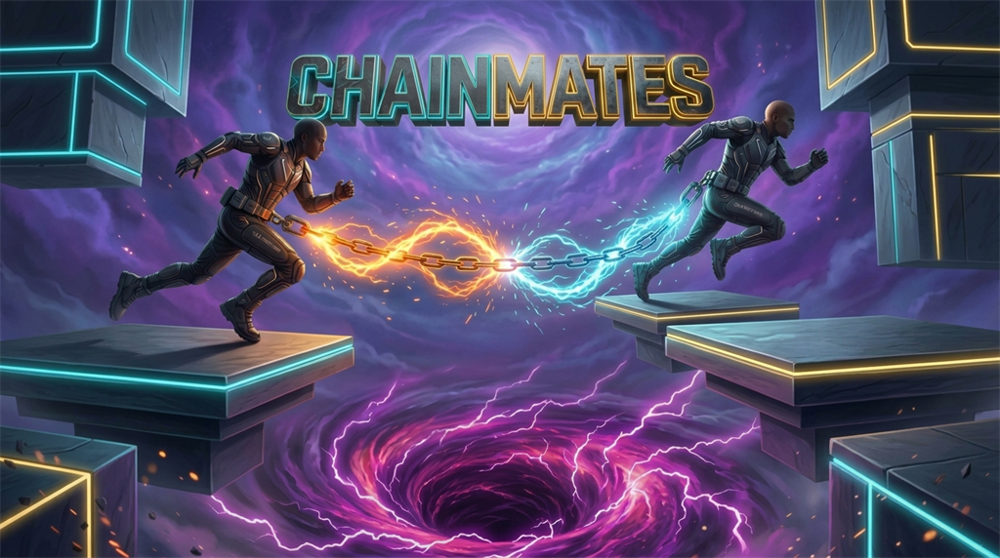

# ⛓️ Chainmates — Scene & Judge Testing Guide

## 🌟 Quick Overview

**Chainmates** is a physics-driven, mobile-first co-op tether platformer for Decentraland. Two players are physically bound by an elastic 7.0m tether and must coordinate their jumps across an endless procedurally recycled spiral tower while outrunning the rising **Electric Void Abyss**.

---

## 🎥 Official Gameplay Demo Video

📺 **Watch on YouTube:** [https://youtu.be/2_w7LrtoAqk](https://youtu.be/2_w7LrtoAqk)  

[](https://youtu.be/2_w7LrtoAqk)

---

## 🕹️ Quick Testing Instructions for Judges & Players

### 🤝 2-Player Co-Op Duo Mode
1. Join the parcel alongside a partner (or open a 2nd browser tab in local preview).
2. The interactive **Lobby UI** automatically displays active players in the scene.
3. Tap **"🔗 INVITE"** next to your partner's name.
4. Partner receives an instant prompt and taps **"✅ ACCEPT"**.
5. Both players are tethered, customized with their chosen skin (Steel Chain / Hemp Rope / Neon Beam), and teleported side-by-side to the launchpad for the 3-2-1 countdown!

---

## 📱 Controls & Ergonomics

| Action | Mobile Client (DCL Mobile App) | Desktop Browser |
| :--- | :--- | :--- |
| **Move** | Left Virtual Joystick | `W` `A` `S` `D` / Arrow Keys |
| **Jump** | Right On-Screen Jump Button | `Spacebar` |
| **Camera** | Drag Screen Surface | Mouse Drag / Right-Click Drag |
| **Interact / UI** | Direct Touch Tap (48–58px Targets) | Mouse Click |
| **Toggle Music** | Audio Icon in Menu | Audio Icon in Menu |

*Note: Unnecessary mobile action buttons (E, F, 1–6) are hidden automatically to provide clean virtual-joystick clearance (`screenInset: 'interactable'`).*

---

## ⚡ Core Scene Mechanics

### 1. Dynamic 7.0m Elastic Tether
- **🟢 SLACK (`< 5.0m`):** Full freedom of movement with natural sag.
- **🟡 TAUT (`5.0m – 7.0m`):** Tension warning glow with elastic resistance.
- **🔴 YANKED (`> 7.0m`):** Overstretched! Elastic impulse physics pulls overextended climbers back toward their partner with audio and visual warning alerts.

### 2. Escalating Electric Void Abyss
- Surges upward continuously from the tower base.
- Ascent speed scales with altitude:  
  $$\text{Velocity} = 0.15 + \left(\frac{\text{Altitude}}{100}\right) \times 0.08\text{ m/s}$$
- The top HUD ribbon displays real-time void gap clearance and ascent velocity in meters per second.

### 3. Infinite Procedural Platform Recycling
- A pre-allocated entity pool of 8 spiral platforms continuously teleports ahead of players as they climb.
- Lower platforms recycle upward with **zero memory leaks**.
- Platforms feature sinusoidal horizontal oscillations, randomized phase offsets, dynamic hazard cylinders (50% chance), and collectible **Cyber-Gems (+250 PTS)**.

### 4. 8 Dynamic Altitude Neon Biomes
- Platforms and trim strips transition smoothly through 8 neon tiers:  
  `Cyber Cyan (0-20m)` ➔ `Radiant Violet (20-40m)` ➔ `Electric Magenta (40-60m)` ➔ `Hyper Gold (60-80m)` ➔ `Emerald Matrix (80-100m)` ➔ `Solar Amber (100-120m)` ➔ `Quantum Indigo (120-140m)` ➔ `Ultra Plasma (140m+)`.

### 5. Authoritative Anti-Cheat Leaderboard
- Backed by a live high-availability Node.js/Express REST server on Render (`https://chainmates.onrender.com`).
- Features multi-tier rate limiting (6 score submissions/min), mathematical bounds validation, solo vs duo segregation, and 3D in-world holographic podium display.

---

## 🚀 Local Development & Preview Commands

```bash
# 1. Install dependencies
npm install

# 2. Start local Decentraland preview
npm run start

# 3. Build & typecheck production bundle
npm run build
```

---

## 📋 Scene Metadata & Deployment Specs

* **Scene Title:** `Chainmates — Endless Co-Op Climb`
* **World Domain:** `OverlookHotel.dcl.eth`
* **Base Parcel:** `0,0`
* **Creator Address:** `0xad0d520fdae7b1ed9a41d2078dbf75a9c5b55129`
* **Required Permissions:** `ALLOW_TO_TRIGGER_AVATAR_EMOTE`, `ALLOW_TO_MOVE_PLAYER_INSIDE_SCENE`, `ALLOW_MEDIA_HOSTNAMES`
* **License:** MIT License
